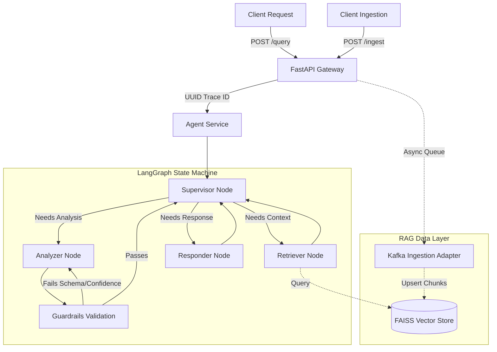

# Multi-Agent LLM Backend 🤖


A scalable, production-style backend system combining **Retrieval-Augmented Generation (RAG)** with a **Multi-Agent Workflow** using LangGraph, FastAPI, and FAISS.

This project was built to demonstrate how data engineering rigor—such as strict schema contracts, event-driven ingestion, and deterministic guardrails—can be applied to GenAI systems to make them reliable, observable, and ready for production scale.

---

## 🌟 Key Engineering Features

- **Microservice Architecture**: Fully decoupled FastAPI gateway handling REST/SSE traffic while an isolated LangGraph state machine orchestrates the LLM logic.
- **RAG Subsystem (Local-First)**: Implements a highly efficient `FAISS` local vector store utilizing HuggingFace's `all-MiniLM-L6-v2` dense embeddings, allowing the system to run seamlessly without expensive cloud vector databases.
- **Multi-Agent Orchestration**: Specialized agents act on a shared `TypedDict` state. 
  - *Retriever*: Pulls semantic context.
  - *Analyzer*: Reasons over context to extract technical JSON findings.
  - *Responder*: Synthesizes final human-readable outputs.
- **Deterministic Guardrails**: The Analyzer's output is programmatically intercepted by a validation node. If it fails JSON schema validation or falls below a 0.3 confidence threshold, the router forces a correction loop—preventing hallucinations from reaching the user.
- **Event-Driven Ingestion**: Features a mock `KafkaAdapter` that asynchronously queues and chunks incoming document events, decoupling heavy embedding workloads from the API serving layer.
- **Observability**: Implements custom `StructuredJSONFormatter` for all logs (injecting trace IDs) and captures in-memory metrics for latency, throughput, and success rates.

---

## 🏗️ System Architecture



---

## 🚀 Quick Start (Local Development)

### Prerequisites
- Python 3.9+
- An OpenAI API Key (or Groq API key if adjusting the LLM provider)

### 1. Setup Environment
```bash
git clone <repo-url>
cd Multiagent-LangGraph
python -m venv .venv
source .venv/bin/activate
pip install -r requirements.txt
```

### 2. Configure Environment Variables
```bash
cp .env.example .env
```
Open the `.env` file and insert your actual `OPENAI_API_KEY`.

### 3. Run the Backend
```bash
chmod +x infra/scripts/run_local.sh
./infra/scripts/run_local.sh
```

- **Interactive Dashboard**: [http://localhost:8000/](http://localhost:8000/)
- **Swagger API Docs**: [http://localhost:8000/docs](http://localhost:8000/docs)

---

## 📡 Core API Endpoints

### `POST /api/v1/query`
Executes the agentic workflow.
```json
// Request
{
  "query": "What is the capital of France?",
  "stream": false
}

// Response
{
  "response": "The capital of France is Paris.",
  "trace_id": "a1b2c3d4...",
  "confidence_score": 0.98,
  "turn_count": 3
}
```

### `POST /api/v1/ingest`
Queues a document for async embedding into the FAISS vector store.
```json
// Request
{
  "source_id": "doc-001",
  "content": "Paris is the capital and most populous city of France.",
  "author": "system"
}
```

### `GET /api/v1/metrics`
Returns system observability metrics.
```json
// Response
{
  "total_requests": 150,
  "success_rate": 99.3,
  "avg_latency_ms": 450.2,
  "total_ingested_events": 25
}
```

---

## 🐳 Docker & Kubernetes

To run the application inside a container:
```bash
docker-compose -f infra/docker/docker-compose.yml up --build
```
*Note: The FAISS index requires C++ build tools, which are pre-configured in the provided `Dockerfile`.*

An example Kubernetes `deployment.yaml` is provided in `infra/k8s/` demonstrating how the stateless FastAPI pods would mount a PVC for the FAISS storage layer in a real cluster.

---

## 📚 Deep Dive Documentation
For deeper technical discussions on how the system was designed, please refer to the focused markdown guides:
- [Workflow & Agents](docs/workflow.md): Detailed breakdown of the LangGraph state.
- [Guardrails & Safety](docs/guardrails.md): Explains the deterministic fallback loops.
- [Evaluation Strategy](docs/evaluation.md): Details on the structured JSON logging.
- [Project Code Walkthrough](docs/walkthrough.md): A guided tour of the module architecture.

---
*Built with a focus on data engineering rigor and LLM reliability.*
